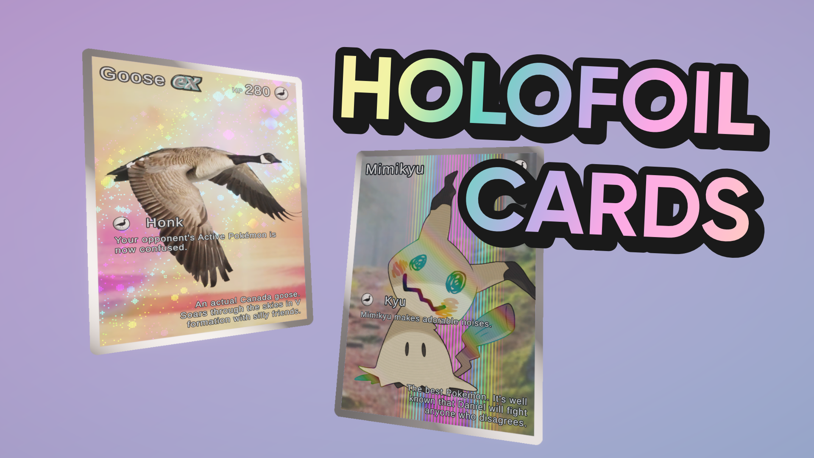

# Holographic Foil Cards with Shader Graph in Unity URP

A holographic card effect, as seen in *Pokémon TCG Pocket* and other trading card games.

## Overview

In *PTCGP*, certain cards have a parallax layer effect where foreground and background elements move around differently when the card is rotated, but they are still bound by the card borders. In the physical TCG, some cards use shiny rainbow holofoil to emphasize their rarity. Some cards are even etched, with raised lines built directly into the card. With this shader effect, and a few other tricks found in URP, you can recreate all of that in Unity.

## Software

This project was created with Unity 6.0.23f1 (LTS) and URP 17.0.3.

## Tutorials

This project is part of a tutorial which is available here:

- [YouTube](https://www.youtube.com/watch?v=p-ifYSABUgg)
- Article (Coming soon!)

## Authors

This project and the corresponding tutorials were created by Daniel Ilett.

## Release

This project was released on May 26th 2025.
